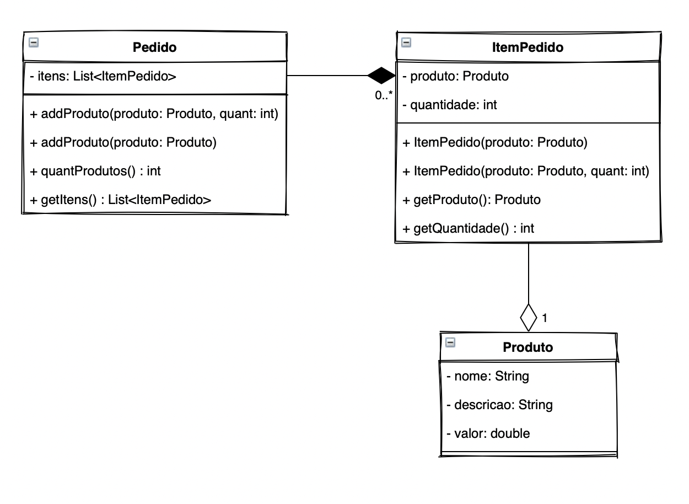

**Universidade Federal da Paraíba - UFPB** \
**Centro de Ciências Exatas e Educação - CCAE** \
**Departamento de Ciências Exatas - DCX**

**Disciplina:** Análise e Projeto de Software \
**Professor:** [Rodrigo Rebouças de Almeida](http://rodrigor.dcx.ufpb.br)

# Atividade 01

Implemente as classes segundo o diagrama abaixo.
* Você deve implementar de modo que os testes existentes passem.
* Você pode acrescentar testes.

Observações:
* Na implementação, garanta que a agregação e a composição estão sendo respeitadas.

